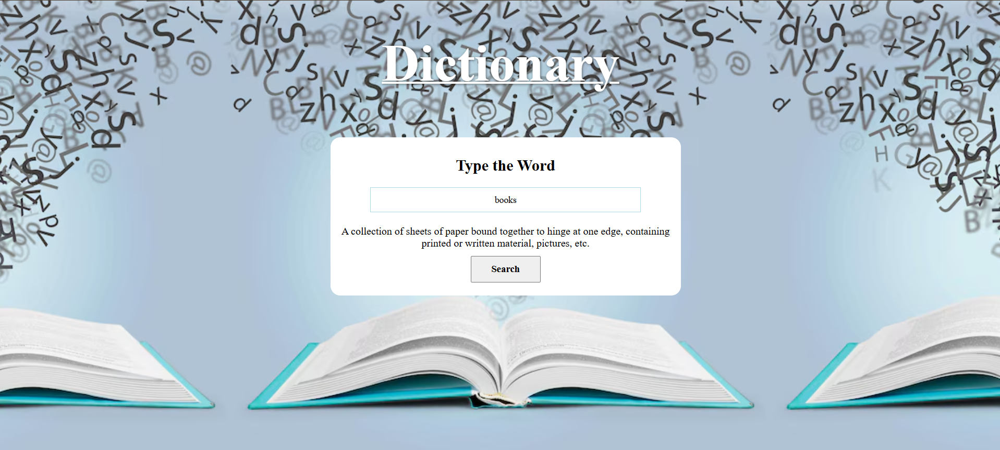

# 📚✨ Dictionary App — Your Word Wizard 🧙‍♂️

Welcome to the **Dictionary App**, a magical little tool that helps you discover the meanings of words instantly! Just type in any word, hit search, and *voilà!* — your definition appears like a charm.

---

## 🌍 Live Demo

🚀 [Try it Live!](https://sarthdhakade963.github.io/Dictionary-App/)  

---

## 🧪 Sneak Peek

---

## 🔥 Features

- 🔎 **Real-time word lookup** — Get instant definitions as you type.
- 🧠 **Simple & clean UI** — No distractions, just the meaning.
- 🌈 **Responsive design** — Works beautifully on desktop & mobile.
- 🧩 **Powered by Free Dictionary API** — Lightning-fast results.

---

## 🛠️ Built With

| Tech         | Purpose                      |
|--------------|------------------------------|
| HTML5        | Structure of the app         |
| CSS3         | Styling & layout             |
| JavaScript   | App logic & word search      |
| Dictionary API | Fetching real definitions |

---

